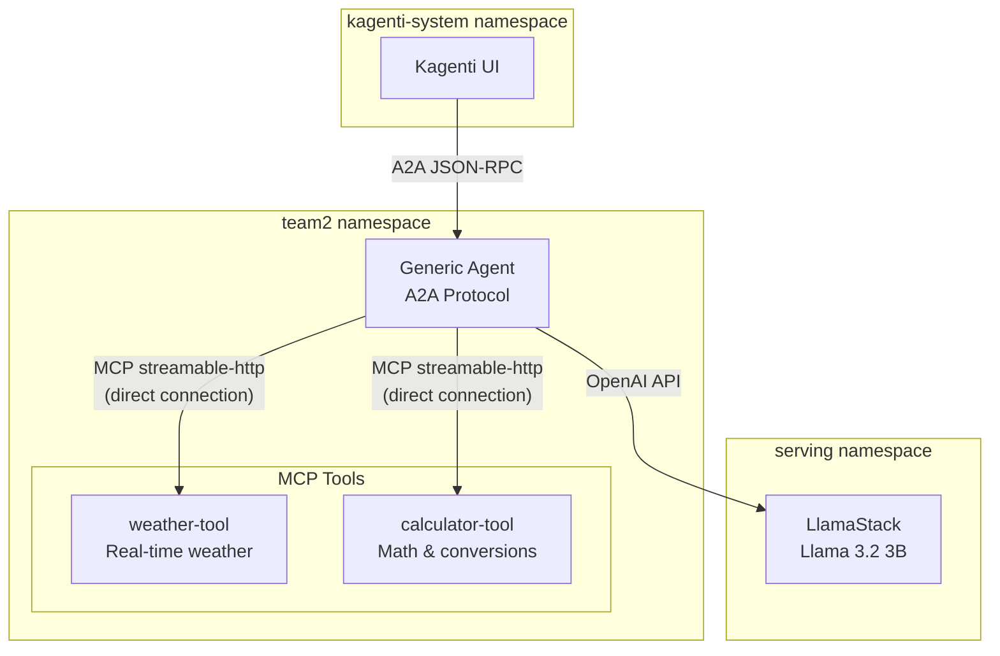

# Kagenti + LlamaStack POC

This folder contains all the Kubernetes manifests needed to recreate the Kagenti + LlamaStack deployment in `team2` namespace.

## About This Folder

| What This Folder Is | What This Folder Is NOT |
|---------------------|-------------------------|
| ✅ **Standalone** deployment for agent + MCP tools | ❌ Does NOT install Kagenti |
| ✅ Complete scripts to deploy from scratch | ❌ Does NOT deploy LlamaStack |
| ✅ All workarounds included | ❌ Does NOT set up RHOAI |
| ✅ Ready to share with team | ❌ Does NOT deploy the Llama model |

**Relationship to other folders in this repo:**
```
kagenti-llama-demo/
├── kubernetes/
│   ├── llama3.2-3b/            # 🔧 Sets up the Llama model (prerequisite)
│   ├── llama-stack-dist/       # 🔧 Sets up LlamaStack (prerequisite)
│   └── kagenti-llamastack-poc/ # ✅ THIS FOLDER - deploys agent + tools
└── README.md                   # General setup guide for prerequisites
```

> **For new clusters:** Follow the root `README.md` first to set up RHOAI, LlamaStack, and Kagenti. Then use this folder.
>
> **For clusters with Kagenti + LlamaStack already installed:** This folder works out of the box.

---

## Prerequisites

Before running these scripts, ensure your cluster has:

| Component | Namespace | Required? | How to Verify |
|-----------|-----------|-----------|---------------|
| **Kagenti** | `kagenti-system` | ✅ Yes | `oc get pods -n kagenti-system` |
| **LlamaStack** | `serving` | ✅ Yes | `oc get llsd -n serving` |
| **MCP Gateway** | `gateway-system` | ⚠️ Optional | `oc get gateway -n gateway-system` |

> **Note:** MCP Gateway is only needed for Tool Catalog UI visibility. The agent calls tools **directly** via `MCP_URLS`, not through the gateway. MCPServer CRs may show `READY=False` (cosmetic issue - tools still work).

**Local tools required:**
- `oc` CLI (logged in with cluster-admin)
- `jq` (for JSON parsing in scripts)

**Cluster-specific config** (may need to update in `agent/03-agent.yaml`):
```yaml
LLM_API_BASE: "http://lsd-llama32-3b-service.serving.svc.cluster.local:8321/v1"
LLM_MODEL: "vllm-inference/llama32-3b"
```

## Quick Start

```bash
cd scripts
chmod +x *.sh

# 1. Setup namespace and permissions
./01-setup.sh

# 2. Deploy the agent
./02-deploy-agent.sh

# 3. Deploy MCP tools (recommended for full demo)
./03-deploy-tools.sh

# 4. Patch MCP URLs (required after deploying tools)
./04-patch-mcp-urls.sh

# 5. Test everything
./05-test.sh
```

## Folder Structure

```
kagenti-llamastack-poc/
├── README.md
├── agent/
│   ├── 01-imagestream.yaml      # ImageStream for agent
│   ├── 02-buildconfig.yaml      # BuildConfig (with upgraded deps)
│   └── 03-agent.yaml            # Kagenti Agent CR
├── mcp-tools/
│   ├── 01-weather-tool.yaml     # Weather MCP server
│   ├── 02-calculator-tool.yaml  # Calculator MCP server
│   └── 03-mcpserver-crs.yaml    # MCPServer CRs for Tool Catalog (optional)
├── rbac/
│   ├── 01-namespace-setup.yaml  # Namespace config
│   └── 02-rbac.yaml             # RBAC for UI access
└── scripts/
    ├── 01-setup.sh              # Setup namespace & permissions
    ├── 02-deploy-agent.sh       # Deploy agent
    ├── 03-deploy-tools.sh       # Deploy MCP tools
    ├── 04-patch-mcp-urls.sh     # Patch MCP_URLS (workaround)
    ├── 05-test.sh               # Test deployment
    └── 06-cleanup.sh            # Remove everything
```

## What Gets Deployed

| Component | Description |
|-----------|-------------|
| **llama-stack-agent** | Generic Agent using LlamaStack (Llama 3.2 3B) |
| **weather-tool** | MCP server providing real-time weather data |
| **calculator-tool** | MCP server for math operations & unit conversions |

## Architecture



**Data Flow:**
1. User interacts with **Kagenti UI** (`kagenti-system`)
2. UI sends A2A JSON-RPC requests to **Generic Agent** (`team2`)
3. Agent calls **LlamaStack** (`serving`) for LLM inference via OpenAI-compatible API
4. Agent calls **MCP Tools directly** (`team2`) when LLM requests tool use

> **Note:** The MCPServer CRs in `mcp-tools/03-mcpserver-crs.yaml` are **optional** - they register tools with the MCP Gateway for UI Tool Catalog visibility, but the agent calls tools directly via `MCP_URLS`, not through the gateway.

## Workarounds Applied

| Workaround | Script/File | Reason |
|------------|-------------|--------|
| Remove Istio labels | `01-setup.sh` | Ambient mode blocks service communication |
| Grant SCCs (anyuid) | `01-setup.sh` | Required for OpenShift builds |
| Grant SCC (privileged) to agent SA | `02-deploy-agent.sh` | Required for SPIRE sidecars |
| Add RBAC | `01-setup.sh` | UI needs access to team2 namespace |
| Upgrade langchain-mcp-adapters | `agent/02-buildconfig.yaml` | Older version (0.1.0) can't connect to MCP servers |
| Patch MCP_URLS | `04-patch-mcp-urls.sh` | Kagenti controller doesn't propagate env var to deployment |
| MCPServer READY=False | N/A (cosmetic) | Broker status endpoint issue - tools still work |

## Testing

After deployment, test with:

```bash
# Port forward
oc port-forward -n team2 svc/llama-stack-agent 8000:8000 &

# Test weather
curl -X POST http://localhost:8000/ \
  -H "Content-Type: application/json" \
  -d '{"jsonrpc":"2.0","method":"message/send","params":{"message":{"messageId":"1","role":"user","parts":[{"type":"text","text":"Weather in Seattle?"}]}},"id":"1"}'

# Test calculator  
curl -X POST http://localhost:8000/ \
  -H "Content-Type: application/json" \
  -d '{"jsonrpc":"2.0","method":"message/send","params":{"message":{"messageId":"2","role":"user","parts":[{"type":"text","text":"Calculate 99*99"}]}},"id":"2"}'
```

## UI Access

```
URL: https://kagenti-ui-kagenti-system.apps.<cluster-domain>/Agent_Catalog
Namespace: team2
```

## Troubleshooting

| Issue | Solution |
|-------|----------|
| Build fails with permission error | Run: `oc adm policy add-scc-to-user anyuid -z pipeline -n team2` |
| Agent pod won't start (SCC error) | Run: `oc adm policy add-scc-to-user privileged -z llama-stack-agent -n team2` |
| Agent not visible in UI | Check labels: `oc get agent -n team2 -o yaml \| grep kagenti.io` |
| Tools not working | Verify MCP_URLS: `oc get deployment llama-stack-agent -n team2 -o jsonpath='{.spec.template.spec.containers[0].env}' \| jq '.[] \| select(.name=="MCP_URLS")'` |
| 503 errors / network issues | Remove Istio labels: `oc label namespace team2 istio.io/dataplane-mode- istio.io/use-waypoint-` |
| MCPServer shows READY=False | This is cosmetic - tools still work via direct MCP_URLS |

## Cleanup

```bash
./scripts/06-cleanup.sh
```
